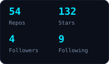
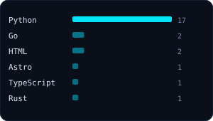

### Hi, I'm Yunhao Wang 👋

Embodied AI & VLA Engineer. MSc CS @ University of Auckland.
Robonix member @ Peking University IT Research Institute.
Build things that move — robotics × learning × vision.

  <samp>
    <a href="https://cloud666666666.github.io">blog</a> .
    <a href="https://github.com/cloud666666666/cat-tremor-analysis">cat-tremor-analysis</a> .
    <a href="mailto:2353493891@qq.com">email</a> .
    <a href="https://github.com/cloud666666666">github</a>
  </samp>

---

**Selected work**

- 🐱 [cat-tremor-analysis](https://github.com/cloud666666666/cat-tremor-analysis) — 猫头部震颤量化:CSRT 追踪 + 光流 + FFT,抗干扰,含鲁棒性与泛化性验证
- 🌌 [tech-blog](https://cloud666666666.github.io) — 具身智能 / VLA / CV 工程实践

